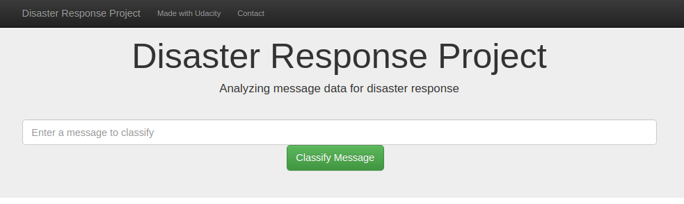
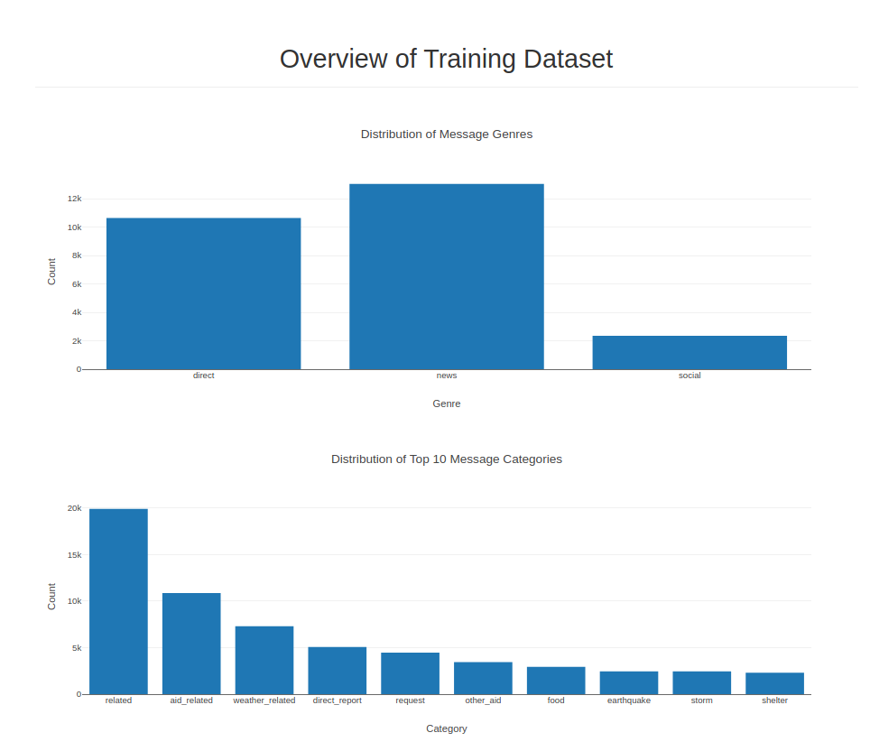

## Disaster Response Pipeline Project

### Table of Contents
1. [Introduction](#Installation)
2. [Getting Started](#GetStarted)
    1. [Dependencies](#Dependencies)
    2. [Installation](#Installation)
    3. [Executing Program](#Execution)
3. [Authors](#Authors)
4. [License](#License)
5. [Acknowledgement](#Acknowledgement)
6. [Screenshots](#Screenshots)

## Introduction 
This goal of this project is to a build a machine learning model that can classify messages
sent on social medial platforms in the event of a disaster. With these messages already classified 
in different categories, disaster response teams can better manage their resources while responding
to these needs.

The project is divided into following sections
1. ETL Pipeline that loads data from files, cleans data and then saves in a sqlite database
2. Machine Learning Pipeline that normalizes and trains model to be used for classifying messages
3. Web application that shows information about data used to train the model and an interface to 
classify messages in in real time
## Getting Started 
### Dependencies 
Following packages were used in this project
* Python 3.8
* sklearn, numpy, sqlalchemy
* nltk
* pickle

There is pipfile in the project directory that can be used to install required packages

### Installation 
Clone this git repository by executing `git clone https://github.com/sumitkumar-00/disaster-response` in console
### Executing Program 
1. Run following commands in project't root directory
   1. To execute ETL pipeline `python data/process_data.py data/disaster_messages.csv data/disaster_categories.csv data/DisasterResponse.db`
   2. To execute ML pipeline `python models/train_classifier.py data/DisasterResponse.db models/classifier.pkl`
   3. To run web app execute `python run.py` from app's directory
2. Go to http://127.0.0.1:3001 to check out the app 
## Authors 
. [Sumit Kumar](https://github.com/sumitkumar-00)
## License 
Feel free to make changes
## Acknowledgement 
I would like to thank Udacity and Figure Eight for making this data available
## Screenshots          
